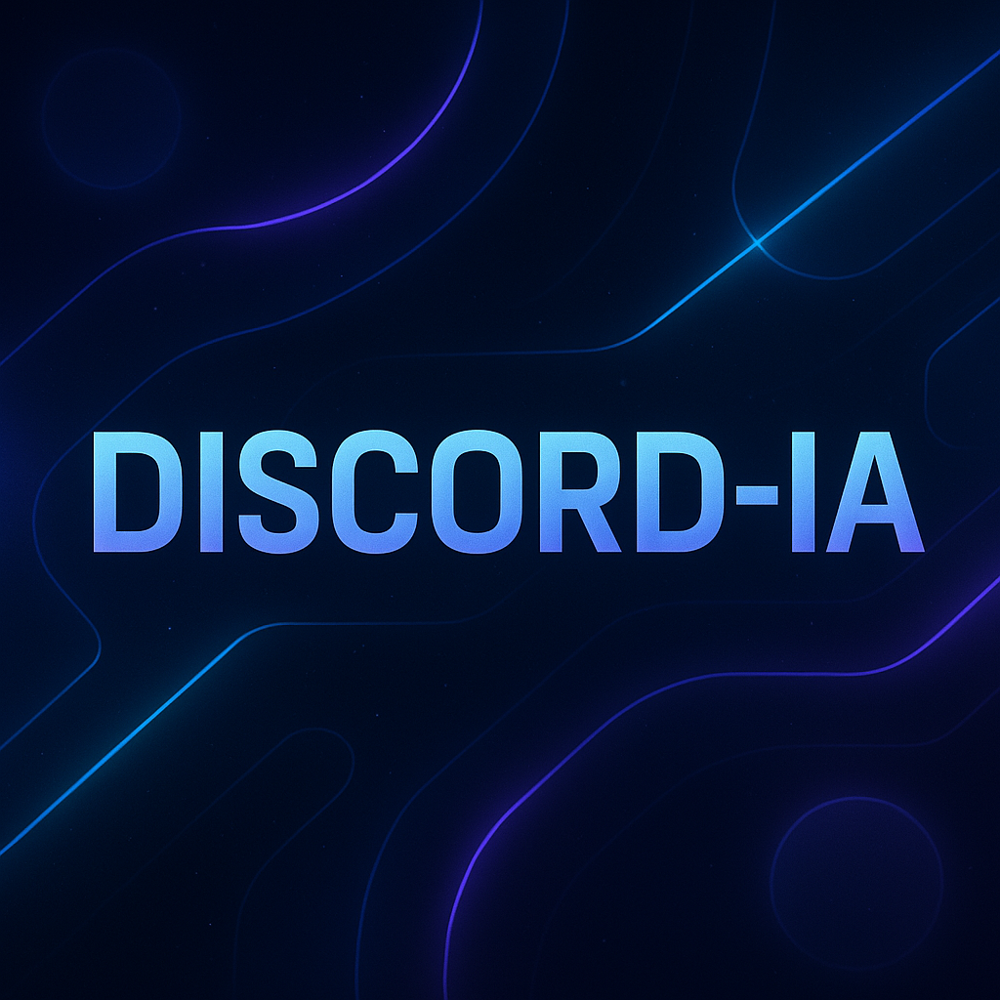
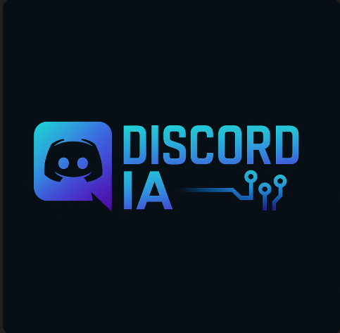

<p align="center">
  
</p>
<p align="center">
  
</p>

# 🤖 Discord-IA Bot

Este proyecto es un bot que conecta la API de Gemini (Google Generative AI) con un canal de Discord mediante webhooks. Puedes escribirle una pregunta en consola y el bot responderá directamente en tu servidor de Discord.

---

## 🚀 Características

- ✔️ Conexión con Gemini 1.5 Pro (Google AI)
- 💬 Entrada por consola para hacer preguntas
- 🔁 Respuestas enviadas automáticamente a un canal de Discord usando un webhook
- 🌐 Uso de variables de entorno seguras con `.env`

---

## 📦 Instalación

### 1. Clona el repositorio

```bash
git clone https://github.com/TapasCode/discord-ia.git
cd discord-ia
```

### 2. Instala las dependencias

```bash
npm install
```

### 3. Configura las variables de entorno

Crea un archivo `.env` en la raíz del proyecto con el siguiente contenido:

```env
GEMINI_API_KEY=tu_clave_api_de_google
DISCORD_WEBHOOK_URL=tu_webhook_de_discord
```

> 🔐 Asegúrate de no subir tu archivo `.env` a GitHub. Ya está protegido por `.gitignore`.

### 4. Ejecuta el bot

```bash
node botDiscord.js
```

---

## 🛠️ Tecnologías usadas

- [Node.js](https://nodejs.org/)
- [Google Generative AI SDK](https://www.npmjs.com/package/@google/generative-ai)
- [Discord Webhooks](https://discord.com/developers/docs/resources/webhook)
- [dotenv](https://www.npmjs.com/package/dotenv)
- [node-fetch](https://www.npmjs.com/package/node-fetch)

---

## 👤 Autor

Desarrollado con 💻 por **Jhon Eider Tapasco**  
GitHub: [@TapasCode](https://github.com/TapasCode)

---

## 📄 Licencia

Este proyecto está bajo la licencia MIT. Puedes usarlo, modificarlo y compartirlo libremente.

---

> ¿Te gusta este proyecto? ¡Dale una ⭐ en GitHub y compártelo!